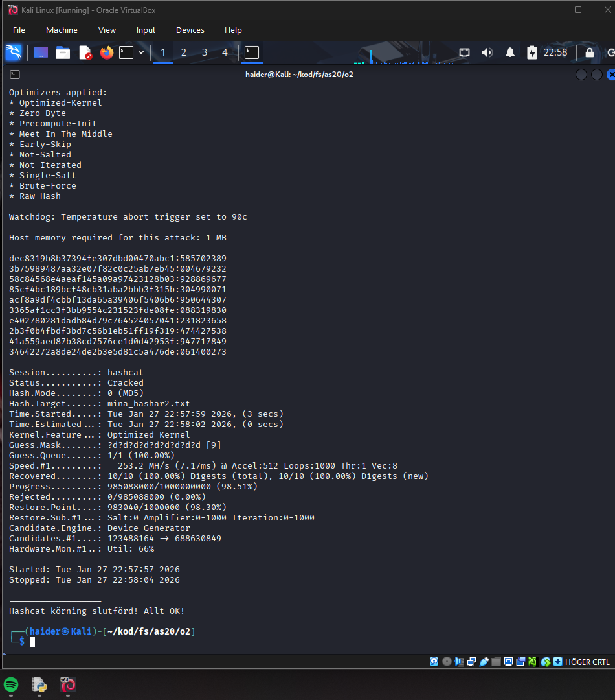

#övning 2 - MD5 Hash Checker with Python and Hashcat


#Description

In this assignment I worked with hashing and password genarator.
When we type our passwords it dosent get stored in raw text, it gets turned it a hash.

Example:SHA256("hello") 2cf24dba5fb0a30e26e83b2ac5b9e29e1b161e5c1fa7425e73043362938b9824.

The assignmenat goal was to generate hash-values and test rainbow  tables and use Hashcat(tool) crack.

MD5-hashs(Message Disesget Method 5 is cryptographic hash algorithm that genrates a 128-bit digest from a string
of any length.

#Repo

- md5-hasher.py (The python code to generate hashes and passwords)
- md5-hashcat.sh (Bash script that run hashcat to crack MD5 based hashes with mask attack)
- mina_hashar.txt (10 MD5-hash values that are use for cracking)
- mina_hashar2.txt (10 extra hash values)
## Installation

```bash
git clone https://github.com/HKSEC/-vning-2-.git
cd o2
chmod +x md5-hashcat.sh
```

## Steps to run

```bash
python3 md5-hasher.py
./md5-hashcat.sh mina_hashar.txt ?d?d?d?d?d
```

## Result
All 10 hashes cracked successfully



 All 10 hashes cracked successfully


